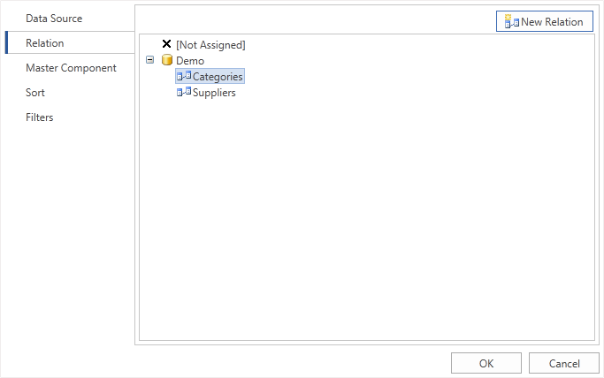

## DataRelation Property

After filling the MasterComponent property it is necessary to fill the DataRelation property of the Detail band. This relation is used to select detailed data only for the specific Master band row. If the relation is not specified, then all Detail band rows will be output for each rows of the Master band.

Selection of relation occurs using the Data band editor, as well as in case with the MasterComponent property.

Selection is done between relations which were created between Master and Detail data sources, and in which the Detail data source is subordinate data source. There can be more than one relation (for example, as seen on the picture above). Therefore,  it is important to select the correct relation.
