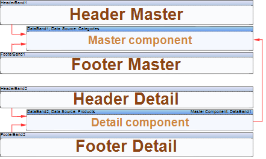

## Headers, Footers and Master-Detail Reports

The principle of using **HeaderBands** and **FooterBands** in **Master-Detail** reports is the same as in simple lists. All **HeaderBand1** bands, which are placed above the **DataBand1** bands, up to the next **DataBand2** band, belong to this **DataBand1** band. The **HeaderBand** is placed on the page above the **DataBand**, which outputs data rows. The **HeaderBand** always refers to any particular **DataBand**. Typically, this band is the first **DataBand**, which is located below the **HeaderBand**.

The **FooterBand** is placed below the **DataBand**. And it is meant that the **DataBand**, with what the **HeaderBand** is bind. Each **FooterBand**, refers to any specific **HeaderBand**. Without the **HeaderBand**, the **FooterBand** is not output.

The picture above shows a structure of a **Master-Detail** reports with two **DataBand** bands**.**
