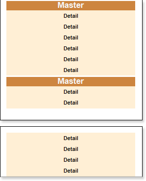
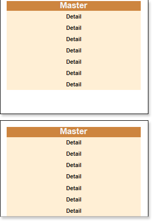

## KeepDetails Property

Sometimes, when creating **Master-Detail** reports, a part Details (subordinate entries) of the **Master-Detail** band will be on one page, while another part will be moved to the next page. This may happen due to the fact that all the detailed records will not fit one page. In this case, if it is still necessary to output the **Master** along with its details on one page, you can use the **KeepDetails** property. By default, this property is set to **false**.

The picture above shows a report in what a part of Details is located on one page, while the other part of details has been moved to the next page. If property is set to **true**, then the report generator will try to place the **Master** and **Detail** records on one page. If the report generator cannot do it, the **Master** and **Details** together will be moved to the next page.

The picture above shows an example of a report with the **KeepDetails** property of the **Master** set to **true**. If it is not possible to put them together, then the data will be forcibly broken and displayed on different pages. In this case, if the **Master** component has many **Detail** records and take a significant part on the page, and the **KeepDetails** property is set to **true**, then there may be a large empty space at the bottom of each page.
