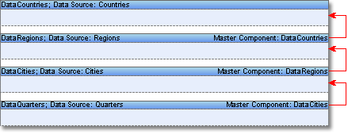
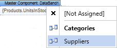

## Multilevel Nesting

The logic of building Master-Detail reports with more than 2 nesting levels is the same as the logic of building simple Master-Detail reports. For each Detail band the MasterComponent and DataRelation properties are set. For example, it is necessary to render a report in what there are four nesting levels. The first level is countries, the second - regions, the third - cities, the fourth - quarters. In this case one should place Data bands one on another on a page for each data source. Set the MasterComponent of the second band on the band countries. This property for the third band will indicate the regions band. For the last band quarters - will indicate on the cities band.

Then it is necessary to select relations for three bands for the report generator is able to select correct data for each detailed band.

Then this report will be ready for rendering. One Master band may have more than one Detail band. In other words two, three or four Detail bands may refer to it. And each of them may have their own Detail bands. There are no limitations on number of nesting levels in the Master-Detail reports.

* **Notice:** Number of nesting levels in the Master-Detail reports is unlimited.
