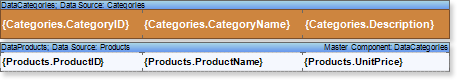
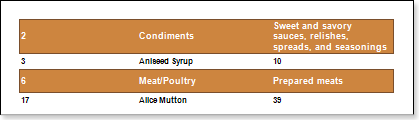
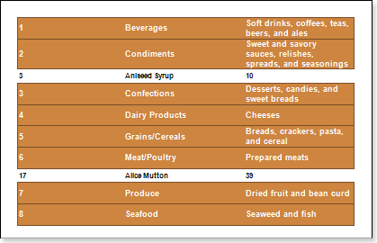

## PrintifDetailEmpty Property

The **PrintifDetailEmpty** property of the **DataBand** band is used in building **Master-Detail** reports. The picture below shows a template of a **Master-Detail** report.

For example, not all **Master** entries have **Detail** records. Then, if the **PrintIfDetailEmpty** property is set to **false**, then the result shown below is obtained:

Only a part of Master records (in the picture above they are marked with numbers 2 and 6) will be output and the remaining Master records (which have no Detail records) will not be output. To print all Master records, regardless whether they have Detail records, it is necessary to set the **PrintifDetailEmpty** property of the Master band to **true**. An example of a report for this case is shown below below:

As seen on the picture Master records were output (see numbers 1,3,4,5,7,8) all Master records. Moreover, they are output without Detail records. By default, the property is set to **false**.
