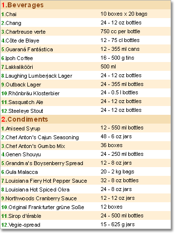
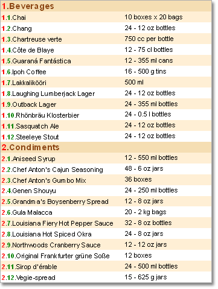

## Rows Numbering in Master-Detail Reports

Rows numbering in the Master-Detail reports works the same as in ordinary lists. But there is on difference. If numbering is used in the Detail of the Data band, then for each sublist there will be their own numbering. For example, on the picture below the Master-Detail report is shown.

Numbering in the Master list is indicated with the red color. Numbering in the Detail list is indicated with green color. As you can see on the picture, the numbering in the Detail list starts every time after the row from the Master list is output.

Besides using system variables numbering can be done using the Line property of the Data band. In this case the expression will be as follow:

{DetailDataBand1.Line}.{Customers.CompanyName}

Why is it necessary? Why not to use the Line system variable? The system variable has the visibility zone. For example, you use the Line system variable on the Master band. In this case numbering will be output for the Master band. If you use the Line system variable on the Detail band, then, in this case, numbering will be output for the Detail band. But what to do if it is necessary to output numbering of two different Data bands in one expression? In this case the Line property of the Data band is used. For example, see the following expression on the Detail band:

{DataBand1.Line}.{Line}.{Products.ProductName}

this will lead to the following result in a report:

