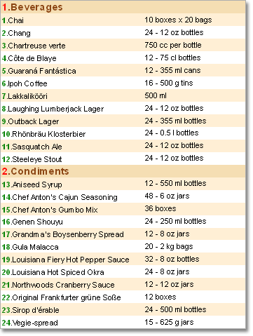

## Through Lines Numbering in Master-Detail Reports

Besides the **Line** system variable, there is also additional **LineThrough** system variable for numbering the **Master-Detail** lists. What is the difference? The **LineThrough** system variable is used to output numbers using the continuous numbering. On the picture below the same report with continuous numbering is shown.

In this case the numbering of the Detail list starts not after the row of the Master list is output but before the first row of the Detail list is output. The system variable starts numbering with 1.
