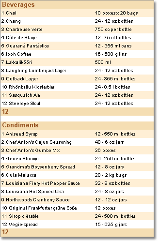
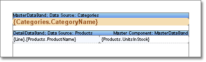

## Creating Master-Detail Lists

> **Information**
>
> You should consider the value of the Multiple Initialization property when creating sub-lists. It's enabling to initialize the data source for each container and detail section. For example, Filters will be applied for each detail section even if Relation is not assigned.

The previous topic describes how to create a report using data as a table. And data are not connected to each other. Three bands were used: Data, Header, and Footer. But sometimes it is required to create reports and output data which are organized in some levels and connected to each other. For example, invoice and a list of goods, clients and goods delivery to them etc. In this case Master-Detail reports are used. These are reports in which the output value of the Master data source, corresponds to the number of values (from 0 and greater) from the Detail data source. On the picture below the example of the Master-Detail report is shown:

As one can see on the picture, each category of products corresponds to the list of products from this category. An example of the Master-Detail report template is shown on the picture below:

Data are output in the Detail part of the Master-Detail report are nested data. These data are as if nested into one data row of the Master data source. And the number of nesting is called the level of nesting. For example, if in the report the Master-Detail report two lists are output and the second list is connected with the first list, then this report will have two levels of nesting (the first is the Master, and the second is the Detail). And if this detailed list will have an additional list which will detail this list, then this report will have three levels of nesting (the first is the Master, the second is the Detail, and the third is the SubDetail). The number of nesting is unlimited. Usually number of nesting is no more than 3-4 levels.
