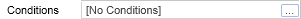
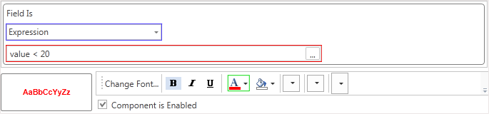
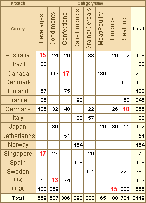

## Conditions

Often, when rendering a cross table, it is necessary that, according to certain conditions, the appearance of a cell will be changed. To achieve this, you can use the Conditions property of columns, rows and, summary cells.

To specify the condition, it is necessary to select a component for what this condition will be executed and call the Conditions editor from the properties panel or from the toolbars.

For example, we need to mark summary cells which values are less than 20.

Add a new conditional formatting for the cell. Make three changes in the condition (see picture below).

Change the value of the Field Is field on the Expression (marked with blue). Specify the required expression (marked with red):

value <20

The value variable contains the total value of the summary cell. And change the text color of cells to red (marked with green). An example of report rendering is shown on the picture below.

