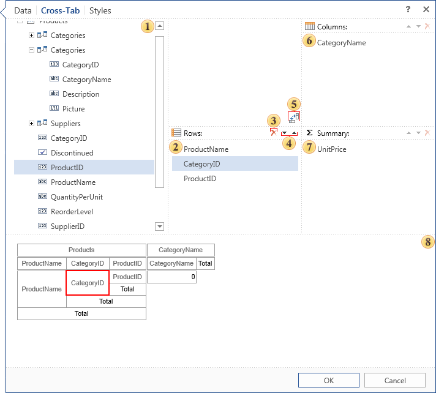

## Cross-Tab Tab

The Cross-Tab tab defines the structure of the Cross-Tab component. It specifies the data column for the rows, columns, total cells:

 The data source that will be used to build a cross-tab.

 A list of data columns that will form the cross-tab row.

 The button to delete the selected item from the field Rows, Columns, Summary.

 If more than one element was added into the fields of the cross-tab (rows, columns, summary) then the buttons will be available to move the selected item in the list.

 The reverse button between the columns and rows. Every press of the button changes the contents of the string field on the contents of the column field.

 The list of data columns that will form the cross-tab column.

 The list of data columns that will create the summery of a cross-tab.

 Displays the preview of the cross-tab.
