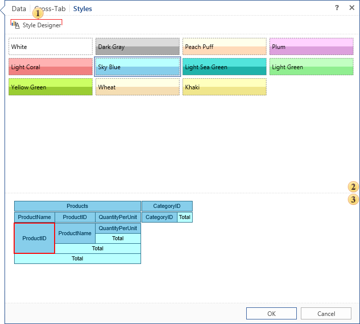

## Styles Tab

The final stage in the creation of a cross-tab is to define its style:

 The button to call the style designer.

 The list of predefined styles available by default. If you need your own style, you need to call the style designer and create a new one. To select the style you need, you simply select it. In this case the preview pane will show the structure of a cross-tab with the style preview.

 The Preview panel. A red box around the cell indicates that the cell is selected.
