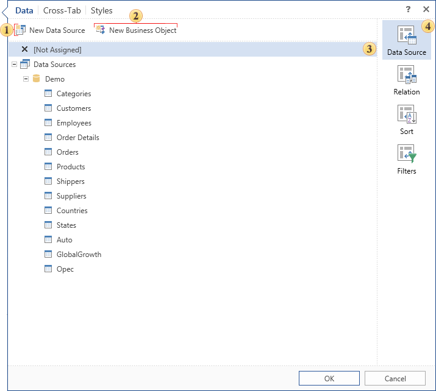

## Cross-Tab Editor

When you create or edit the Cross-Tab component, a special editor will be called when editing the component. The editor tabs - Data, Cross-Tab, Styles - contain the configuration settings of the Cross-Tab component. In addition, the settings and parameters are grouped on each tab.

 The New Data Source button. Calls the window to create a new data source.

 The New Business Object button. Calls the window to create a new Business Object.

 In this field you can find settings and parameters. The picture above shows the selected group Data Source. The filed shows all available data sources. Select the data source that will be used when creating the cross-tab.

 The list of parameters and settings for the active tab.

As seen from the picture above, in the Data tab, and all settings are divided into the following groups:

* Data Source

In this group, you can select the data source for the cross-tab. In addition, there are buttons to create a new data source and new Business Object.

* Relation

In this group, you can set the relation between the selected sources. There is also a new button New Relation, when clicked, it calls the create new relation window.

* Sort

In this group, you can set the sorting parameters. You need to set the data column by which sorting will be done and the direction of sorting.

* Filters

In this group, filtering parameters are determined. A new filter is added and filtering criteria through the expression or value is specified.
