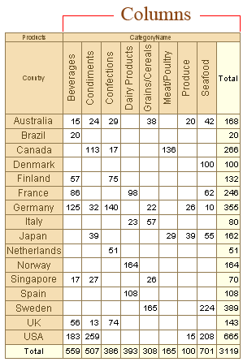
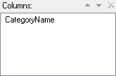
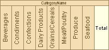
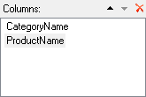
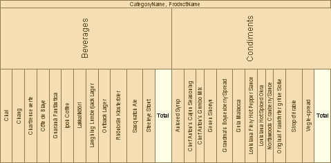

## Columns

On a picture below you may see how the columns are positioned on a table.

It is allowed to specify one or several columns at once. For example, in cross table only one column is specified:

As a result we get grouping by values of this column:

If to specify more than one column:

Grouping is output by values of two columns. Values of the first column are output first. Then the value from the second column is output:

