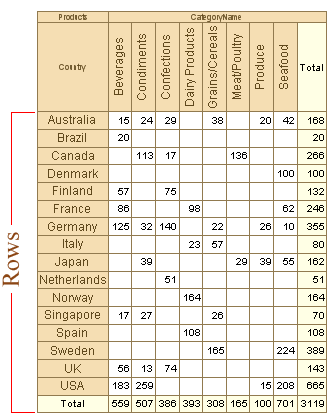
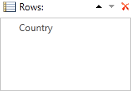
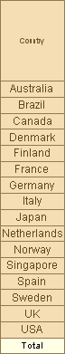
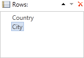
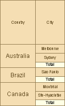
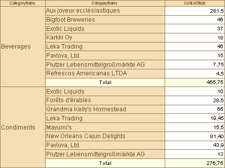

## Rows

On a picture below you may see how the rows are positioned on a table.

Grouping is done only by its values for one row:

Get the result shown on a picture below. All values of the specified row are represented in one level.

Specify two rows:

A cross table is grouped in two levels vertically:

In a cross table you may not specify columns or rows. For example, if columns are not specified, then grouping will be done by rows. For some reports this property is very important for a cross table. The picture below shows one those reports:

