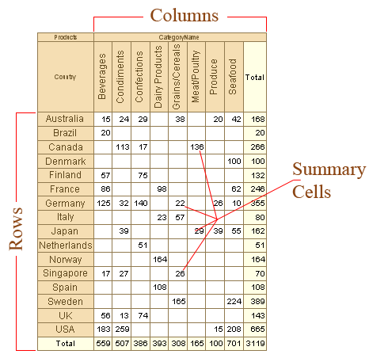
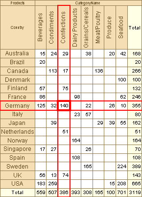
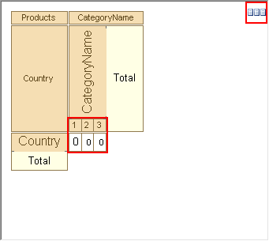
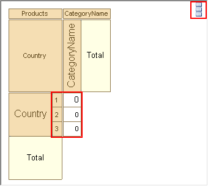

## Summary Cells

Summary cells are the elements of a cross table, which set rules for cells formatting on intersection of columns and rows of a summary cell. On a picture below the structure of a simplest cross table is represented.

In a summary cell all values from the data source which are suitable for a particular condition are grouped. The condition is the coincidence of the value of the column and the row from a data source with the value of the column and row of a cross-table. The value of a cross table column and a row is indicated by intersection where the summary cell is placed. For example, see a simple cross table on a picture below:

The red rectangle indicates the summary cell with the 140 values and also a column and a row of this cell. In this cell all values from the data source which CategoryName column is equal to Confection and Country row is equal to Germany were grouped. The rules of grouping are set using the **Summary** property of a summary cell.

If more than one summary cell is set in a Cross table then it is possible to define the direction of placing of these cells. The reporting tool can place them horizontally from left to right or vertically from top to bottom. On a picture below a table with horizontally placed summary cells is shown.

On a picture below a table with vertically placed summary cells is shown.

