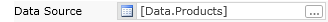
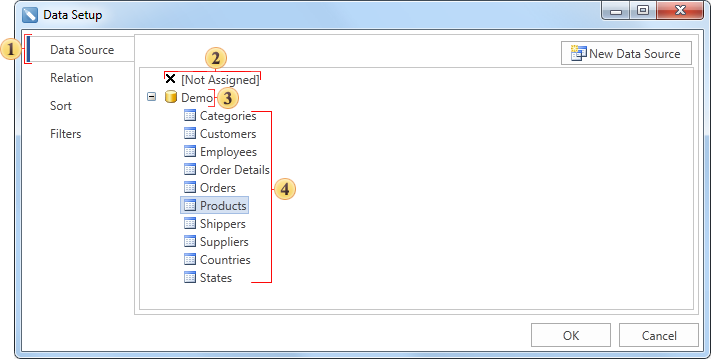
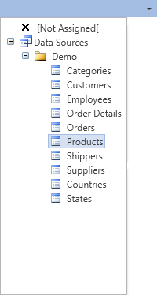

## Data Source Property

Data are the base for cross table rendering. So the cross table rendering should be started from selecting the data source. The data source can be selected using the Data source.

It is necessary to specify the data source that will be used. There are several ways how to do this. The first way. You may use either the **DataSource** property or the Table editor.

A data source can be selected by clicking the first tab of the Data band editor. All data sources are grouped in categories. Each category corresponds to one connection with data in the report data dictionary.

The tab to select the data source;

Select this node if you do not need to specify the data source;

The "Demo" data category;

The "Demo" data source category.

The second way. The data source can be selected using the cross table editor. It can be called by double click on the cross table.

