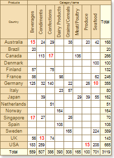
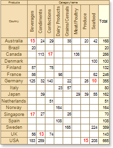
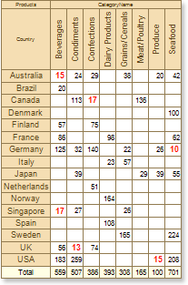

## Showing Totals

**Rows** and **Columns** of a cross-table have the **ShowTotal** property, which allows you to show or hide totals by rows and columns. If this property for **Rows** and **Columns** is set to **true**, then the totals by rows and columns are visually displayed. The picture below shows an example of a cross-table with a visually displayed results:

If, for example, the **ShowTotal** property is set to **false** for rows, then the total by rows will not be displayed. The picture below shows an example of a cross-table, where the **ShowTotal** property of rows is set to **false**:

If, for example, the **ShowTotal** property for columns is set to **false**, then total by columns will not be displayed. The picture below shows an example of a cross-table, where the **ShowTotal** property of columns is set to **false**:

By default, the **ShowTotal** property for rows and columns is set to **true**, totals by rows and columns are displayed.
