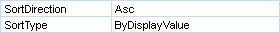
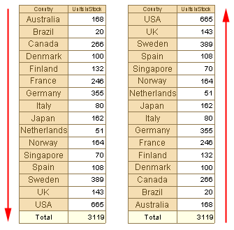

## Sort Direction

The values of the source data that are used to group rows and columns are always re-sorted with the component of a cross-table. Resorting is necessary  in order that, when showing a cross-table, rows and columns do not contain duplicates. But this behavior can be changed. The type sorting is specified using two properties: SortDirection and SortType. These properties are available for columns and rows of a cross-table.

Using the SortDirection property it is possible to set the direction of sorting. Sorting can be in ascending order, descending, or no sorting. The SortType property sets the source of values for sorting: by value or by the displayed value. The picture below shows a table, sorted in two different directions.

