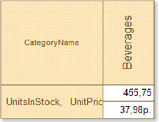
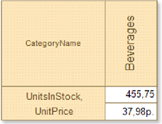

## Word Wrap

Each component of the cross-table has the WordWrap property, which lets you wrap text from one line to another. If the WordWrap property is set to false, then the text is in one line, and if it does not fit in one line it will be cut. The picture below shows an example of a cross-table with the WordWrap property set to false:

If the WordWrap property is set to true, then text wrapping goes automatically. When wrapping a text on the new line the vertical and horizontal alignment are taken into the account. The picture below shows an example of a cross-table that has the WordWrap property set to true:

By default, the WordWrap property of cross-table components is set to false.
