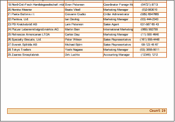

## EmptyData Band

The **Empty Data** band is used to fill free space on the bottom of a page with additional empty data rows formatted to match the displayed data. This example shows a page without an **Empty Data** band:

Adding an **Empty Data** band to the same page changes the look of the empty part of the page to match the formatting of the rest of the data.

**Example**

Create a new report with borders around the text items on the data band. Then drop an Empty Data band after the Data band. If there is more than one**Data** band on the page then you should place the **Empty Data** band after the last **Data** band, but before any footer bands.

* **Note:** To output Footer bands on the bottom of a page set the **PrintAtBottom** property of each **Footer** band to **true**.

Then add text objects to the empty band to match those on the Data band. The result should look something like this:

If you then run the report you will see that the empty space is replaced with formatted empty data rows:

* **Note:** This band is not working on the Panel and Sub-Report.
