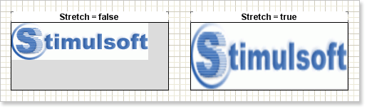
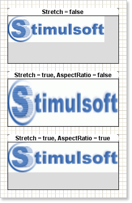

## Image Stretching

Often image size does not fit to the component size. In this case free space can be found in a component. Sometimes an image size is bigger that the component size. In such situations it is necessary to stretch images to fill the component with the image. For this, it is necessary to put the **Stretch** property of the Image component to **true**.

After setting the **Stretch** property to **true** the image will fill all free space of the component. When stretching, the image its proportions can be broken. To stretch an image and keep its proportions it is necessary to set the **AspectRatio** property to **true**. And the **Image** component will always keep proportions of images.

* **Important:** The **AspectRatio** property is in process only when the image stretching is enabled.
