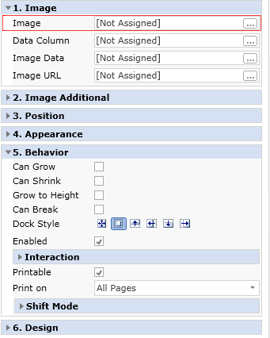
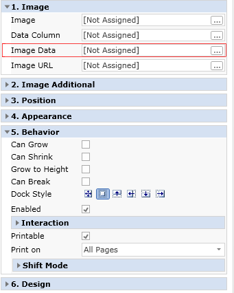
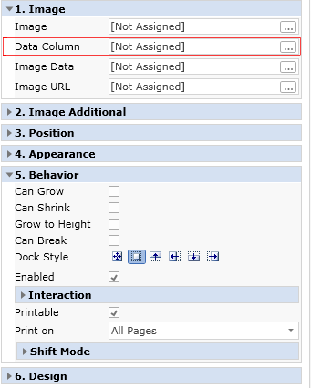

## Loading Images

To print an image it is necessary to use the Image component. But an image should be loaded first. There are three ways:

 Load an image from a file;

 Load an image from the report code;

 Load an image from the data field.

 Load an image from the URL.

The below topics describe all these ways.

Loading an image from a file

An image can be loaded from a file. Using the File property it is necessary specify the file path that contains an image. When  report rendering, the report generator will check whether such a file does exist and contains an image. Then the image will be printed.

Loading an image from a report code

Sometimes it is not convenient to store images for report rendering in files. The report generator can save it in the report code. Using the Image property it is possible to load an image from the report code. After loading the image will be saved in the report code.

* **Important:** Do not use this way to output images with the size &gt;100kb. This can be critical for speed of working with the report designer.

Loading an image from a data field

All it is required to load images from a data field is to specify the data field, from what the image will be loaded. The DataColumn property is used for this.

