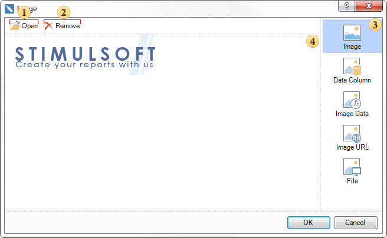

## Resources of Images

Sometimes you need to add some image to the report. It could be images of goods, personnel, statistics, etc. Images can be added from different sources. To insert images, photos in a report in the Report Designer, you should use the **Image** component. The Image component should be put in the report where you want the image be placed (report page, data band, header band, footer band, etc.). When you add this component in the report, the dialog will be called:

 Opens the dialog to select an image for the report.

 Remove the selected image.

 The list of sources from which to load an image.

 The window where the uploaded image is shown.

As seen from the above picture, the images can be downloaded from various sources. Consider them in more detail

* **Image**

Click the **Open** button and select the required image. This is a procedure of loading the image from the local source.

* **Data Column**

An image can be placed in the data table, for example, as a separate data column. Select the data column from which to extract the image.

* **Image Data**

Load an image from the expression. In this case specify some expression for this.

* **Image URL**

You can upload a picture from a **URL**. When rendering a report, the image will be retrieved from the specified URL. Consequently, in this type of source, you must specify the URL of the image.

* **File**

In addition to loading images directly, it can be retrieved from a file that is downloaded from a local source. With this type of source, press the 

 button and select the file.
