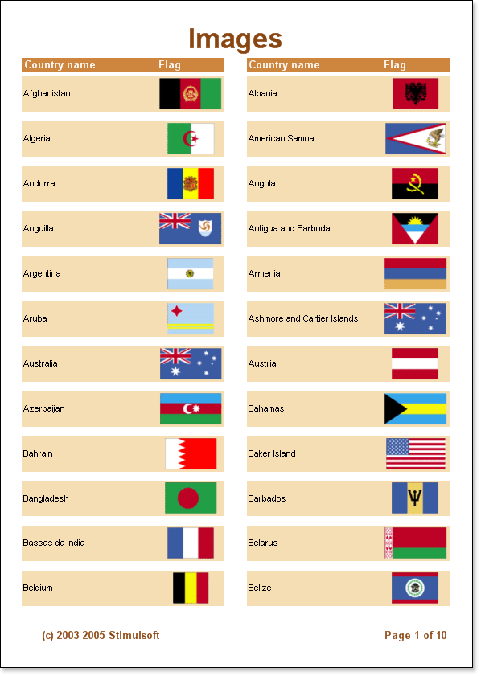

## Graphic Information Output

Sometimes it is necessary to add images to reports. They can be photos of goods, images of colleagues etc. Sometimes it is necessary to place a company logo. The **Image** component is used to output images. This component supports the following types of images: **BMP, JPEG, TIFF, GIF, PNG, ICO, EMF** and **WMF**.

