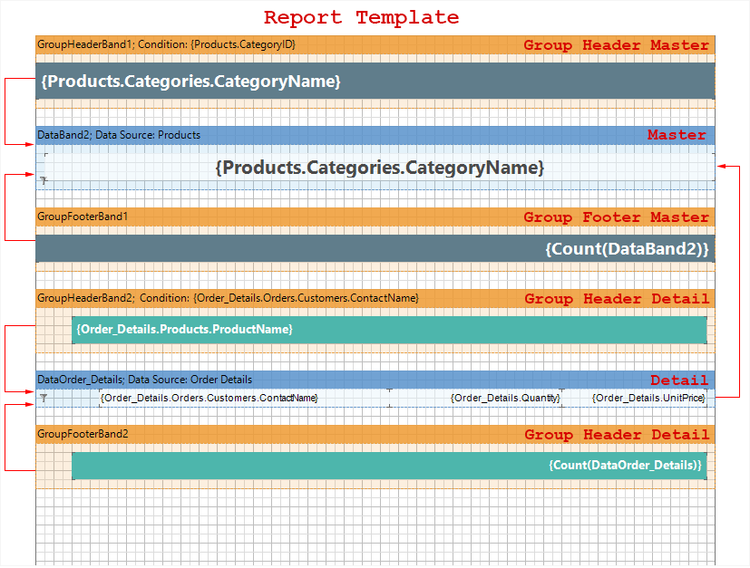
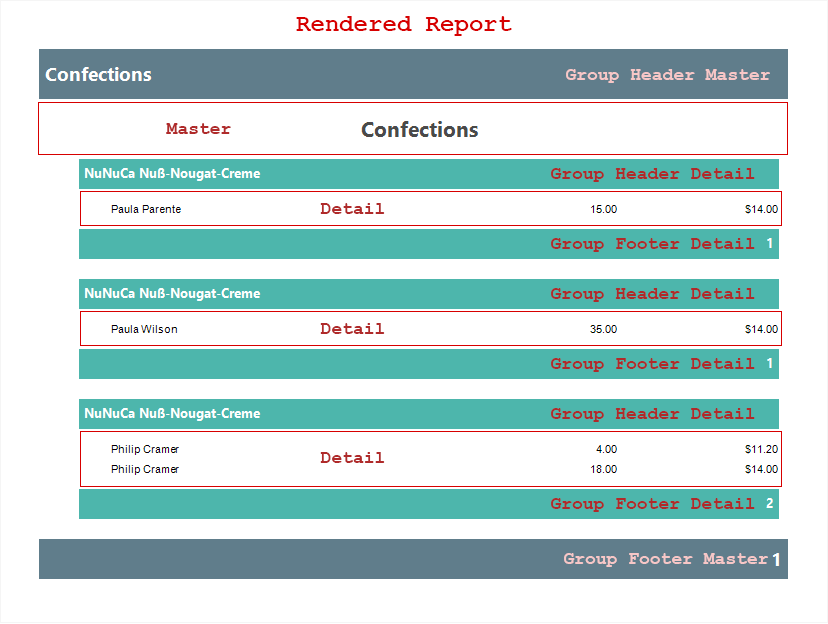

## Combining Groups and Master-Detail Reports

In Master-Detail reports it is possible to group both Master and Detail components. When creating a report, the report generator binds a group header and the Data band. The Group Header is placed on a page above the Data band, which outputs data rows. The Group Header band always refers to a specific Data band. Typically, the band is the first Data band, which is placed below the Group Header band. To render a report with the grouping, the Data band is required. The Group Footer band is placed below the Data band. It is meant that very Data band, with what the Group Header band is bound. Each Group Footer band, refers to a certain Group Header band. The Group Footer band will not be output if there is no the Group Header band.

The picture above shows a combination of **Group Header** band and **Group Footer** band bands with **Data bands** in a **Master-Detail** report.
