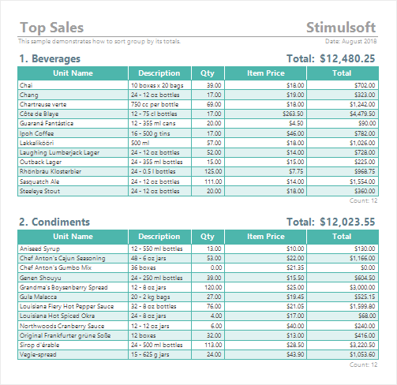
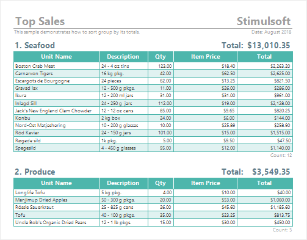
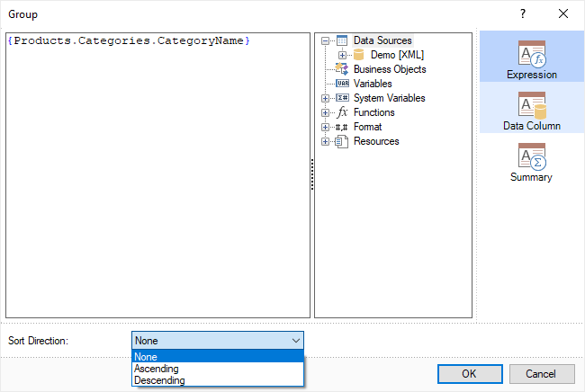
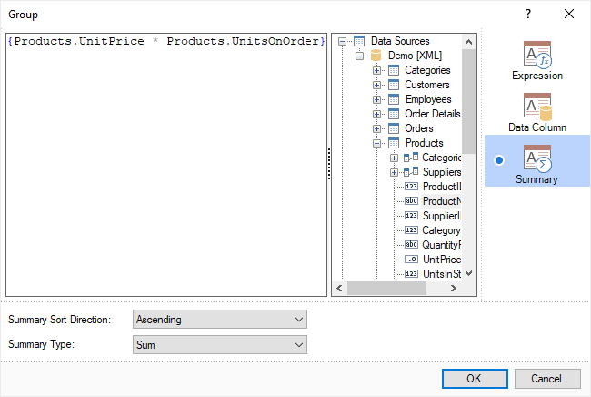
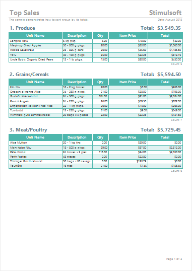
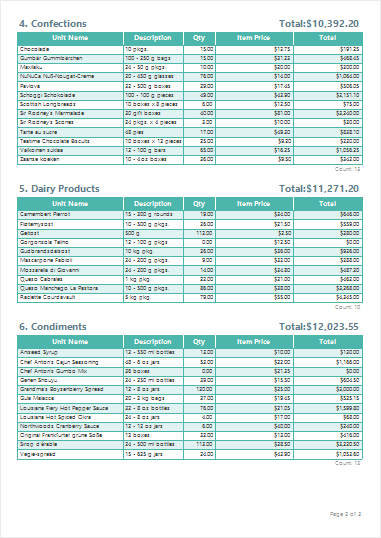

## Data Sorting in Group

When creating reports, you can sort both the data in a group and the groups themselves.

> **Information**
>
> It is important to note that the report writer automatically sorts rows of data before grouping. The default sorting is in ascending order (from A to Z).

**Sort data in a group**

In order to sort data in a group, you should define the condition and sorting direction of the Data Band in this group. Further information on sorting in the Data Band you may find in [this chapter](../Creating_Lists/Data_Sorting.md).

**Group sorting**

Groups can be sorted by:

- The values of the expression that is used as a [grouping condition](Grouping_Conditions.md);

- The values of the total expression, which are the values of the expression that calculation functions are applied to.

Sorting can be performed in the following directions:

* **None** - the data will be displayed in the order they appear in the data source.

> **Information**
>
> If the data is already grouped and sorted before being transferred to the report, then there is no need to further group and sort it based on the [grouping condition](Grouping_Conditions.md). Setting the sort direction to **None**, in this case, can reduce the time it takes to generate the report when dealing with large amounts of data.

* **Ascending** - the data is displayed in ascending order, from smallest to largest for numeric values and in alphabetical order from A to Z for text values.

* **Descending** - the data is displayed in descending order, from largest to smallest for numeric values and in reverse alphabetical order from Z to A for text values.

**Sorting groups based on grouping condition values**

By default, all groups in the report are sorted based on the values of the expression used as the [grouping condition](Grouping_Conditions.md), in ascending order. To change the sort direction, you should:

- Select the **Group Header** band and alter the value of the **Sort Direction** property in the properties panel;

- In the **Group Header** band editor, select a value for the **Sort Direction** parameter in the Expression or Data Column tabs.

**Sorting groups based on total expression values**

Very often, in a report with groups, it calculates the total for each of these groups. Often, you need to sort these groups based on the calculated total. To do this, you should do the following:

- Go to the Summary tab in the **Group Header** band editor.

- Specify a calculation expression for the total, such as a revenue expression. Note that sorting by total values is automatically enabled as soon as an expression is defined on the Summary tab. If the expression on this tab is deleted, sorting by total values will be disabled.

> **Information**
>
> If sorting by the values of the total expression is enabled, then sorting by the values of the grouping condition expression will not be performed.

* Select the calculation function for the **Summary Type** parameter. For example, you can choose the sum or average calculation function.

* Select the sort direction for the **Summary** **Sort Direction** parameter. For example, you can choose ascending order, which means groups will be sorted from the lowest to highest revenue.

Additionally, you can configure the sorting settings by the total expression values using similar properties on the properties panel.

To do this, follow these steps:

* Select the **Data Header** band;

* Set the total calculation expression as the value of the **Summary Expression** property;

* Select the total calculation function as the value of the **Summary Type** property;

* Select the sort direction as the value of the **Summary Sort Direction** property.

The following is an example of a report where the groups are sorted by the total expression values in ascending order.

