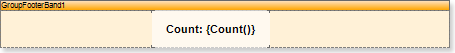
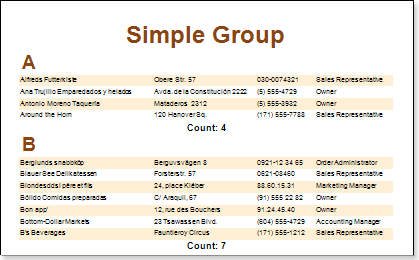

## GroupFooter

It is enough to place a text component with an aggregate function in a Group Footer to output footer by group. Also, the footer of a group may be placed in a Group Header band. For example, to count the number of rows in each group in a Text component the following expression can be used:

{Count()}

A component is placed in the Group Footer band.

After rendering, it is possible to see that in the footer of each group calculation by number of rows is done.

