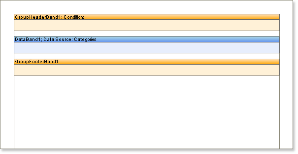

## GroupFooter Band

The **Group Footer** band is commonly used to generate a group footer which is placed after the **Data** band bound to the group and typically contains components that output summary information relating to the group content. Every **Group Footer** band belongs to the **Group Header** band associated with it, and will not be output if there is no associated **Group Header** band.

* **Note:** The **Group Footer** band is always output before the Footer band regardless of where bands may be positioned on a page.

The **Group Footer** band is used to output information specific to each group. For example, if you want to output the number of rows in a group, it is enough to  put a text component on the **Group Footer** band and assign it the following expression:

{Count()}
