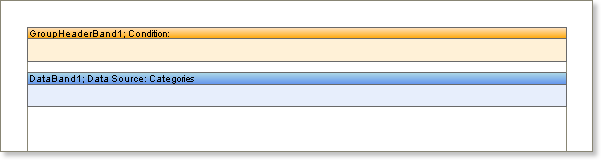

## GroupHeader Band

The Group header is created using the Group Header band, the basic band for rendering reports that use grouping. It is impossible to generate grouped reports without using a Group Header band.

The Group Header band is output once at the beginning of each group and typically contains components that display header information such as a group name, date, grouping condition, etc.

To create groups within a report you must specify a grouping condition using the Group Header band designer or the Condition property of the band.

* **Note:** The Header band is always output before the **Group Header** band, regardless of where bands may be positioned on a page in the designer.

When rendering a report the report generator binds the group header to the specified Data band. The Group Header band is positioned on a page before the Data band that outputs data rows. The Group Header band always belongs to a specific Data band, usually the first Data band positioned under the Group Header band.

You must have a Data band to be able to render grouped reports because data rows are output using this band and because those data rows are the basis of the grouping in the report. In addition you can specify the sorting of rows in the Data band which will affect the order in which the groups are rendered.

* **Important:** To render reports with grouping you MUST use a Data band.
