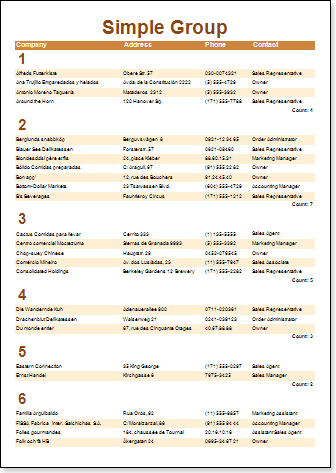

## GroupLine System Variable

Numbering of groups in the report generator is defined by the GroupLine system variable. Group numbering starts with 1. The picture below shows an example of a report with numbering of groups:

A text component with the GroupLine system variable can be placed in the Group Header band band, and in the Group Footer band band.
