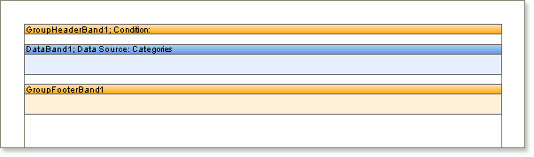

## Groups Without A GroupHeader

In grouped reports is is usual to display both a group header and a group footer. However, what if you need to output only group footers without group headers?

When creating grouped reports you must use a Group Header band, but if you do not want it to display it can be hidden by setting the height of the Group Header band to 0 which will cause the report to be rendered successfully but the Group Header band will not appear in the output.

