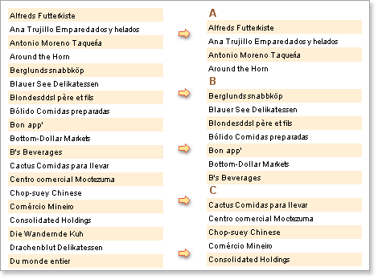

## Grouping Conditions

To create a report with grouping it is necessary to define a condition by which the records can be grouped. This condition will be used to divide the data rows into suitable groups, and is set using the Condition property of the Group Header band.

* **Important:** You MUST define a condition for every group, otherwise no grouping will take place in the rendered report.

For example, if you create a report that generates a list of companies the results could be grouped in alphabetical order by the first letter of the company name. Companies with names starting with A would be in the first group, companies with names starting with B would be in the second group and so on, as in the example below:

The grouping condition you use can be any valid value. For example, if you wanted the companies to be grouped according to their location you could set the condition to group on a column from the database that contains the necessary location data.
