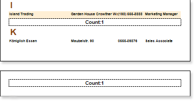
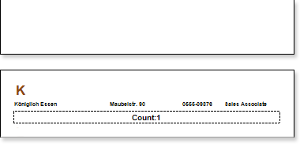

## KeepGroupFooterTogether Property

The **Group Footer** **Band** has the **KeepGroupFooterTogether** property. If the property is set to **false**, then the data can be placed on one page and the footer of a group on another, and data of groups will be separated from its footer:

If the property is set to **true**, then at least one line of data will be together with the footer of a group:

By default this property is set to **true**.
