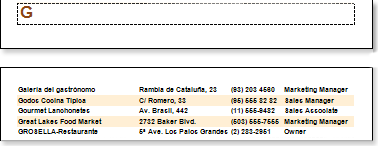
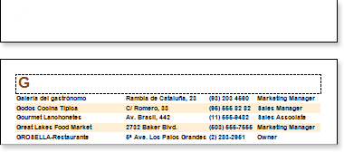

## KeepGroupHeaderTogether Property

The **Group Header** **band** has the **KeepHeaderGroupTogether** property. If the property is set to **false**, then the group header can be displayed on one page, and data of a group to another page. So data will be separated from its header. The picture below shows that the header is on one page, and the data were moved to another.

If the property is set to **true**, then the group header will be displayed with at least one row of a group. The picture below shows how a group will be output if the **KeepHeaderGroupTogether** property is set to true.

By default the **KeepHeaderGroupTogether** property is set to **true**.
