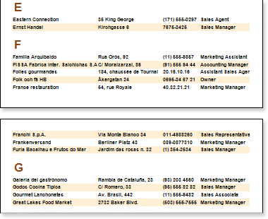
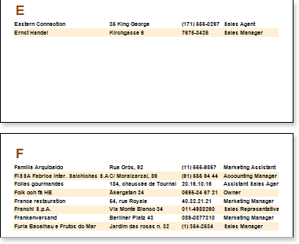

## KeepGroupTogether Property

When rendering a report with grouping, a group may not fit to one page. Several lines of group will be output on one page and other part on the next page.

This can be avoided using the KeepGroupTogether property of the Group Header band. If to set this property to true, then, if a group cannot be placed on one page, the whole group is moved to the next page. If it is impossible to print a group on the next page then the group will be forcibly broken and output on multiple pages.

Work with this property may lead to empty space on page, if groups contain a large number of rows.
