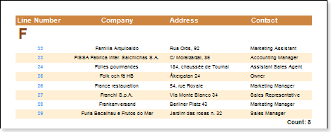

## LineThrough System Variable

One of the tasks of lines numbering is through numbering in a group. The numbering starts with number 1. Through numbering of lines in a group is defined by the LineThrough system variable.

In other words, when using the LineThrough system variable, all rows in the rendered list have an index number and start of printing a new group header does not affect the numbering (numbering does not reset to its initial state equal to 1).
