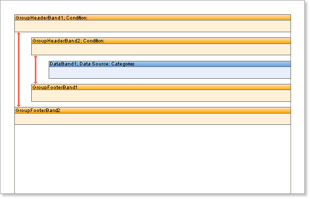

## Nested Groups

When rendering grouped reports you may use more than one grouping to achieve the desired output, known as 'nesting'. For example, you might group Customers by location and then sub group them alphabetically. To achieve this style of report you should put the required number of **Group Header** bands before the **Data** **band** and ideally the same number of **Group Footer** bands immediately after it:

Although it is possible to leave out unwanted **Group Footers** it is recommended that you always place equal numbers of **Group Header** and **Group Footer** bands on a report to avoid unexpected results. If the number of **Group Footer** bands is greater than the number of **Group Header** bands then  the outer ones will be used and the inner bands ignored. If the number of **Group Footer** bands is less than the number of **Group Header** bands, then the **Group Header** bands placed closer to the **Data** band will be output without footers.

* **Important:** It is recommended to have equal number of GroupHeader and GroupFooter bands in a report.

In each **Group Header** band you must specify the grouping criteria. When rendering the report the **Group Header** bands are processed in the in which they appear on a page working from the top down, the topmost band is processed first, then the one that is placed directly underneath it and so on. When placing **Group Footer** bands on a report page it is important remember that the last **Group Footer** band is always associated with the first **Group Header** band.
