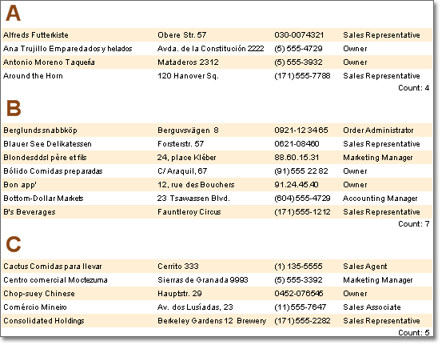

## Groups

One of the main tasks when rendering reports is grouping the data. Grouping can be used both for the logical separation of data rows and to make a report look better. Two bands are used to create grouped reports: the **GroupHeader** band and the **GroupFooter** band.

The **GroupHeader** band is output in the beginning of each group. The **GroupFooter** band is output in the end of each group. The picture below shows how a report with grouping may look:

