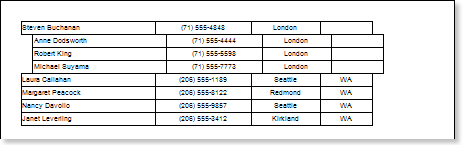

## Data Output

To obtain a structured list in a report as a tree, you must follow these steps:

 Specify the **DataSource** for the **Hierarchical** **band** using, for example, the **DataSource** property:

 Set the **KeyDataColumn**, select the data column by what an identification number of data rows will be assigned. For example, a **EmployeeID** data column;

 Set the **MasterKeyDataColumn**, select the data column by which a reference to the primary table key of the parent entry will be specified. For example, a **ReportsTo** data column;

 Set the **Indent**, specify the indent distance of the child entry relative to the parent entry. For example, the **Indent** value will be equal to **20** units of a report (centimeters, inches, one hundredth inches, pixels);

 Set the **ParentValue**, specify an entry that will be a parent for all rows. For example, set the **ParentValue** property to **2**.

The picture below shows an example of a rendered  hierarchical report:

