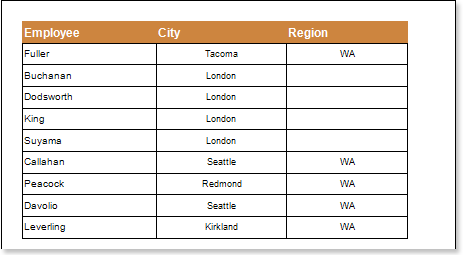
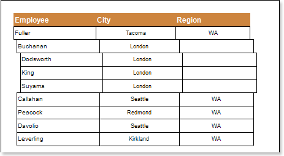

## Indent Property

To visualize the hierarchy of a report you need to change a value of the **Indent** property. The value of the **Indent** property is the distance at which an entry in the hierarchy, relative to the previous level of the tree, will be moved. If the **Indent** property is set to 0, then the indent will not be performing. The picture below shows an example of a rendered hierarchical report with the indent of 0:

If the **Indent** property is set to any value greater than 0, for example 10, the shifting will be on 10 units of a report (centimeters, inches, one hundredth of inch, pixels). The picture below shows an example of a rendered hierarchical report with the indent of 10 units in the report:

If you want a text component, which is located in the **Hierarchical** **band**, do not move, you should change the value of the **Locked** property of this text component. If the **Locked** property is set to **true**, then the text component will not be shifted. If the **Locked** property is set to **false**, then the text component will be shifted. The picture below shows an example of a rendered hierarchical report:

As can be seen on the picture above, the **Locked** property of the **Employee** text component is set to **false**, so the entries were shifted. And for the **City** and **Region** text components, this property is set to **true**, so the entries were not shifted.

* **Important:** The parent entry is not shifted. Only subordinate entries are shifted: the lower the priority is, the further is shifting, relative to the parent entry.
