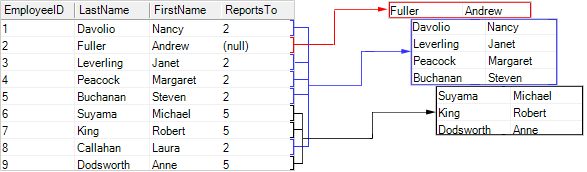

## MasterKeyDataColumn Property

To represent an hierarchy in the report, you must specify the value of the **MasterKeyDataColumn** property. This property is required for filling. If the value of the **MasterKeyDataColumn** is not specified, the report generator cannot determine the hierarchy in the report. The value of this property will be a data column from the selected **Hierarchical** **band** of the data source, which entries are the master key for creating an hierarchy in the report. For example, if the **Employees** data source is specified for the **Hierarchical** **band**, then the **MasterKeyDataColumn** property is the **ReportsTo** column data. The values of this data column are used to specify to what this element in the table is subordinated. Usually, this column indicates the keys in the data column, which is a value of the **KeyDataColumn** property. The picture below shows the scheme of an hierarchy of the **ReportsTo** data column:

