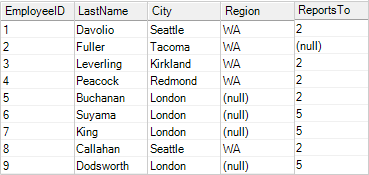
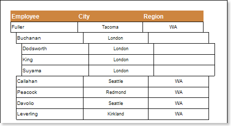
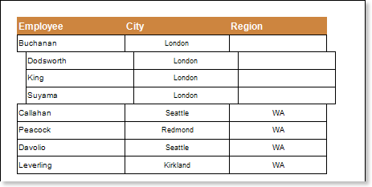

## ParentValue Property

The ParentValue property is used to identify entries which will be the parent rows for the remaining rows in a report. Parent rows are rows which are placed on the top level of hierarchy and in which all other elements are included. The report must have at least one parent line, if the parent line is missing, the report cannot be rendered. The ParentValue property can take any value, which is an entry in the data column, which is listed as the MasterKeyDataColumn. For example, if the MasterKeyDataColumn property is the ReportsTo data column, then the value of the ParentValue property will be entries in this column. The picture below shows an example of the EmployeeID, LastName, City, Region, ReportsTo data columns of the Employees data source:

As can be seen in the ReportsTo data column the following entries are: (null), 2 and 5, any of these entries may be the value of the Parent Value property. If the value of this property is not specified, or is specified as a "space", then the default value is used. By default, the value of the Parent Value property is set to null, the parent row for all rows will be a line where there is a (null) entry in the ReportsTo data column. In this case, this is a row with the ID 2. The picture below shows an example of a rendered report:

If the value of the Parent Value property is set to 2, then the parent row for all rows will be a row where there is a 2 entry in the ReportsTo column data. In this case, these are rows with ID 1,3,4,5,8. The picture below shows an example of a report, where the value of the Parent Value property is set to the 2 value:

