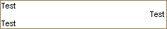

## HTML &lt;text-align&gt; Tag

The &lt;text-align&gt; tag specifies the horizontal alignment of an element with respect to the surrounding context in the text component. The tag supports four modes of alignment: **left**, **right**, **center,** and **justify**. For example, if you enter the following expression:

Test&lt;br&gt;&lt;text-align="right"&gt;Test&lt;/text-align&gt;&lt;br&gt;Test&lt;br&gt;

then after calculation the result appearing in the report will be:

