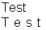

## HTML <letter-spacing> Tag

## The <letter-spacing> tag is used to define the space between letters. The value of this tag can be set in any units, and the value can be negative, so it is very important to make sure that a text is readable after applying this tag. By default the value of this tag is 0.

## For example, if you enter the following expression:

Test <letter-spacing="0.5">Test</letter-spacing>

then after calculation the result appearing in the report will be:

