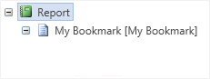
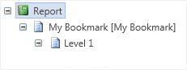
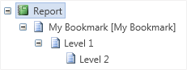

## Bookmarking Using Code

Using the **Interaction.Bookmark** property very complicated structure of bookmarks in a report can be formed. But sometimes it is not enough of this property. For example, it is necessary to add nodes to the tree of bookmarks without using the **Interaction.Bookmark** property. Or the bookmark should be placed on another level of nesting. The **Interaction.Bookmark** property of Stimulsoft Reports can be used. This is an invisible property, and it is available only from the code. It is very simple to use this property. For example, to add the bookmark of the first level of nesting the following code can be used:

Bookmark.Add("My Bookmark");

This code will create this bookmark in the tree of bookmarks:

To add a bookmark of the second level to the tree, it is necessary to write the following code:

Bookmark["My Bookmark"].Add("Bookmark Level2");

...and for the third level:

Bookmark["My Bookmark"]["Level2"].Add("Bookmark Level3");

To create all three bookmarks, the code sample shown above can be used. Stimulsoft Reports automatically checks the presence of each bookmark in a tree and will add ones which should be added. Sometimes it is required to organize navigation using bookmarks. If it is necessary to find components, the **Interaction.Bookmark** property of these components should be logged. The value of the **Interaction.Bookmark** property should be the same with the name of the created bookmark. For example, add the bookmark:

Bookmark.Add(Customers.CompanyName);

So the values of the **Interaction.Bookmark** property should be as follow:

{Customers.CompanyName}

As a result, all components will be marked with a bookmark with the company name. The same company name will be added to the report tree. And, when clicking on the bookmark node of the report tree, all components will be found.
