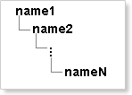
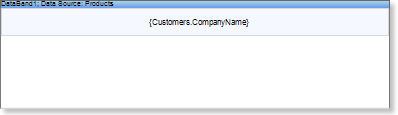
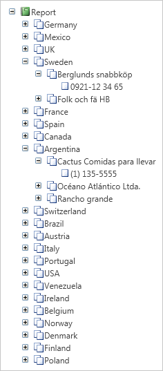

## Creating Bookmarks Using Expression

Using the expression, it is possible to form a rather complex structure of bookmarks in a report. Even a flat report (containing no subordinate entries) can be represented as a hierarchy of bookmarks. General view of the expression with which one can submit any report as a hierarchy of bookmarks is as follows:

%\name1\name2...\nameN

where name1 is the name of the highest level bookmark;

nameN is the name of the lowest level bookmark.

The picture below shows the expression hierarchy of a common type:

In the name of the bookmark, the following things can be specified: function, expression, data source column, system variables, random names, aliases, and more. To make a flat report with the hierarchy of bookmarks, create a single Data band, place the band on a text component with the Company Name data source column. The picture below shows an example of a report template:

When rendering the report, a list of companies will be built, but the tree of bookmarks will not be shown. To show the hierarchy of bookmarks, you should to specify an expression (see an example below):

%\{Customers.Country}\{Customers.CompanyName}\{Customers.Phone}

As seen from the expression, the hierarchy of bookmarks will be represented in three levels:

The highest level will be represented as bookmarks that correspond to the name of the country.

The middle level will be represented as bookmarks that correspond to the name of the company.

The lowest level will be represented as bookmarks that correspond to the phone number of the company.

The picture below shows an example hierarchy of tabs:

