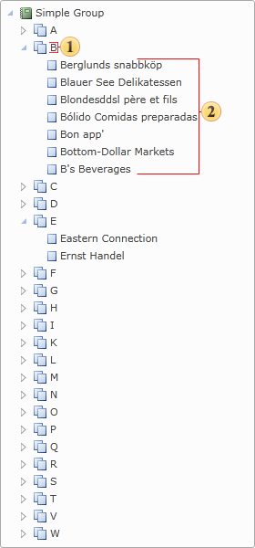

## Tree of Bookmarks

The tree of Bookmarks allows viewing the hierarchical structure of a report. For example, two bookmarks were specified: one on the Master band and the second on the Detail band. In this case, each element of the Master band bookmark fits a node of the bookmarks tree. All elements of bookmarks from the Detail bands will be added to the proper node of the Master band.

