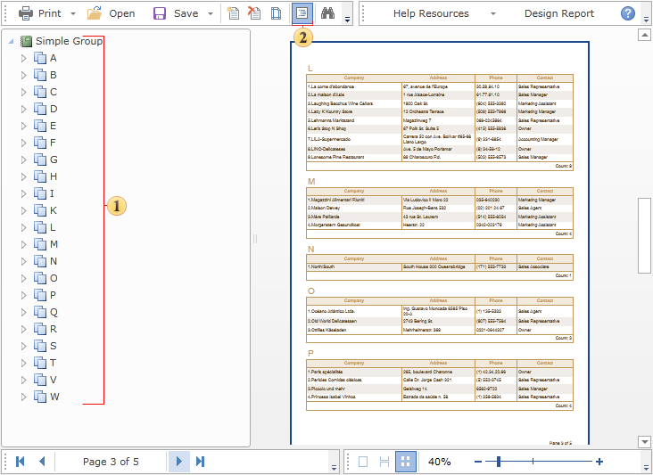

## Bookmarks

Bookmarks are used to show the structure of a report. Also, bookmarks are used to mark the component to refer to it using hyperlinks. All components have the **Interaction.Bookmark** property. The expression, specified in this property, is set to **BookmarkValue** property. Setting occurs when the report is rendering. This property is invisible in the **Properties** panel, but it can be called from the report code or refer to it from the expression. Before showing a report in the window of preview, Stimulsoft Reports views all components of a rendered report and logs a tree of bookmarks.

