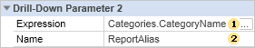

## Drill-Down Parameters

When you create an interactive report using **Drill-Down** relations, there is a possibility in the report generator to specify the parameters to be passed from the main report to the detailed one. For example, you can pass a parameter to be used for filtering data in a detailed report. Also, you can initialize properties (**Report Alias**, **Report Title**, **Report Description**) of the detailing a report by specifying them in the parameters of the detailed report. Suppose there is an interactive report that contains the category names and details of products related to these categories. Let's make each detailed tab has the category name by which it is open. To do this, change the values ​​of properties for the group **Drill-Down Parameter**:

 Specify the name of the parameter in the field of the **Name** property. To initialize a report property, you must specify its name in the name of the detailed parameter. In this case, you must specify the **ReportAlias**.

 In the field of the **Expression** property specify an expression that is evaluated each time you pass a parameter to the report. In this case, you must specify the expression **Categories.CategoryName**.

Now, in the rendered report, a tab with the detailed data will have the category name, which has been interpreted. The picture below shows a report that was built with the tabs of detail:

As can be seen from the picture above, the categories **Beverages**, **Confections**, **Grains/Cereals**, **Produce** were detailed. And the tab, which is located on the detail of these categories have names of categories, respectively.

Detailed description of using parameters can be found at [Drill-Down Report Using Page in Report](../../Getting_Started/Drill-Down_Report_Using_Page_in_Report.md) and [Drill-Down Report Using External Report](../../Getting_Started/Drill-Down_Report_Using_External_Report.md).
