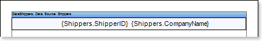
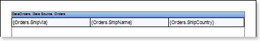
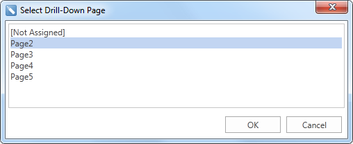
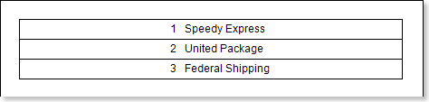
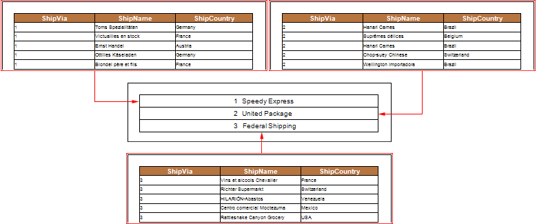

## Drill-Down Report Using Report Pages

The drill-down report using a report page means an interactive report in which detailing goes using a different page of this report template. To create this report, you should set the value of the Interaction.Drill-Down Page property for a component, which should be detailed. The value specifies a page with detailed information. Consider the example of a Drill-Down Report using the page. The Data Band and a text component in it should be placed in the first page of the report template. Specify the data source Shippers for the band. In the text component indicate the expression {Shippers.ShipperID} and {Shippers.CompanyName}. On the second page of the report put a Data Band and a text components in it, select the data source Orders for this band. Insert the expressions in the text components: {Orders.ShipVia}, {Orders.ShipName} and {Orders.ShipCountry}, respectively. The picture below shows two pages of the report template:

Also, add the Header Band on a page with detailed data. Then, select the text component with expressions {Shippers.ShipperID} and {Shippers.CompanyName} and change the values ​​of some properties. The Interaction.Drill-Down Enabled property must be set to true. Then, set the value of the Interaction.Drill-Down Page property to the page on which the detailed data are placed. In this case, it is the Page2. The picture below shows a window for selecting detailing pages:

Also, specify the Drill-Down Parameters, if necessary. In each setting you should change the following properties: Name and Expression. In this case, define a detailed parameter with the name ShipperID and the expression Shippers.ShipperID. Set data filtering in the Data Band, which will contain detailed data, . To do this, add a filter and specify a filtering expression: (int)this["ShipperID"] == Orders.ShipVia. After that, you should render a report. The picture below shows a rendered page of the report:

As can be seen from the picture above the page with the main data is rendered. To display detailed information, you should click the rendered text component. Then, the report generator, considering the Drill-Down Options and filtering data on the Data Band, renders the second page of the report template. The picture below shows a schematic detailing of the report:

